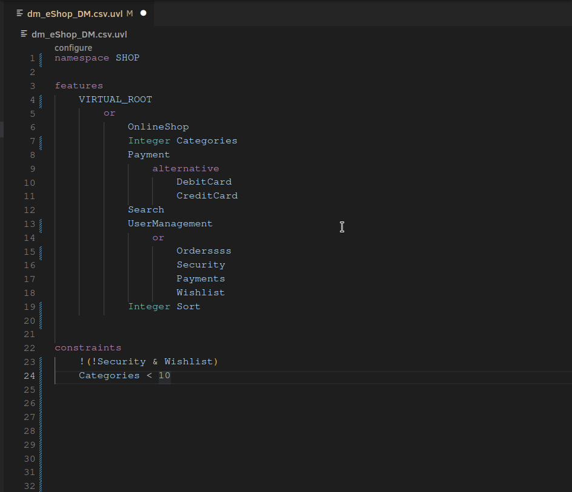

# UVLS - Universal Variability Language Server
[UVL](https://github.com/Universal-Variability-Language) language server based on [tree-sitter](https://github.com/tree-sitter/tree-sitter).

## Getting started
### Build
- Requirements
    - Rust 1.65+
    - Git
```
git clone https://codeberg.org/caradhras/uvls.git
cd  uvls
cargo build --release
```

### VSCode
There are prebuilt binaries for most common platforms so just installing the extension is enough.
```
ext install caradhras.uvls-code
```
### NeoVim

## Features
- Completions
- Syntax highlighting
- Error messages
- Goto definitions and references
- Semantic analysis via [z3](https://github.com/Z3Prover/z3)
- Configuration via json or through an interactive web interface
- Code inlays


## Z3 Support
To enable feature analysis, z3 has to be in PATH. Install it via your favorite package manager or directly from [sources](https://github.com/Z3Prover/z3). Find instructions for some popular operating systems below.

### Windows
Download [Chocolatey via Powershell](https://www.liquidweb.com/kb/how-to-install-chocolatey-on-windows/) and run the command below. The PATH will be set automatically after a restart.
```
choco install z3
```

### macOS

```
brew install z3
```

### Debian/Ubuntu

```
sudo apt-get update
sudo apt-get install z3
```

## Configuration Editor

## Why tree-sitter
We use tree-sitter as an initial parser to create a loose syntax tree of UVL code fragments.
Because the tree-sitter grammar is more relaxed than the original UVL-grammar and has great error recovery,
we can capture many incorrect expressions and provide decent error messages in most cases.
Tree-sitter queries allow for easy symbol extraction and are used to transform the tree-sitter tree into a more compact graph.
This graph is then used for further analysis.
Queries are also used for syntax highlighting as tree-sitter was originally intended for that.


