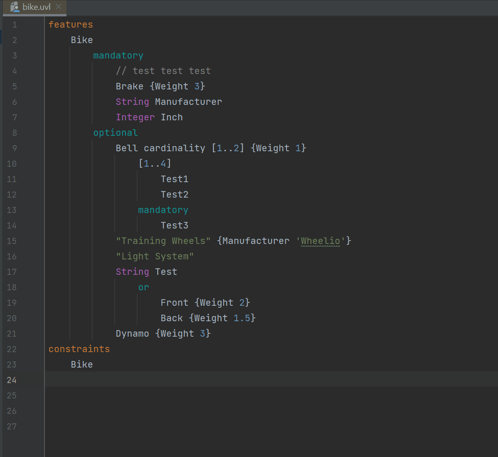

# UVLS (Universal Variability Language Server) in JetBrain IDEs
UVLS is a language server for [UVL](https://github.com/Universal-Variability-Language) (Universal Variability Language).

The server is still in active development but should provide a solid editing experience.

## Installation

- Install [this LSP Support Plugin](https://plugins.jetbrains.com/plugin/10209-lsp-support) to your IntelliJ/PyCharm/CLion IDE.
- Download and unpack an UVLS executable [here](https://github.com/Universal-Variability-Language/uvl-lsp/releases).
- Configure it in `File`->`Settings`->`Languages & Frameworks`->`Language Server Protocol`->`Server Definitions`  
Select `Executable`, set `uvl` as the Extension and include the path to the unpacked `uvls.exe` executable.
- For Highlighting: `File`->`Settings`->`Editor`->`File Types` and click on the `+` on the top left corner.  
Configure the uvl highlighting like so:  
Name: `UVL`, Description: `Universal Variability Language`  
Line comment: `//`, Block comment start, end: `/*`, `*/`  
Keywords (include each block within a different level):
  ```
  features
  constraints
  imports
  include
  namespace
  ```
  ```
  String
  Real
  Integer
  Boolean
  ```
  ```
  mandatory
  or
  optional
  alternative
  ```
  ```
  len
  floor
  ceil
  sum
  avg
  ```  
  IMPORTANT: After configuring, you need to set the file name pattern.  
  Select the newly created UVL File Type and click on the `+` below `File name patterns`.  
  Enter `*.uvl`.  
  Now every `*.uvl` file will be highlighted 


## Notes
The LSP Plugin is not maintained but works good enough for our purpose.

## 
