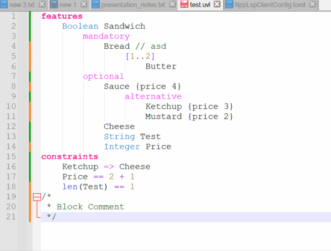

# UVLS (Universal Variability Language Server) in Notepad++
UVLS is a language server for [UVL](https://github.com/Universal-Variability-Language) (Universal Variability Language).

The server is still in active development but should provide a solid editing experience.

## Installation

- Integrate the UVL Notepad++ UDL as [described here](https://superuser.com/a/1057185).  
  Choose the `UVL_dark.xml` if you use a dark theme. Otherwise some colors might not appear readable.
- Install the [NppLSPClient Plugin](https://github.com/Ekopalypse/NppLspClient) and restart Npp
- Download and unpack an UVLS executable [here](https://github.com/Universal-Variability-Language/uvl-lsp/releases).
- Choose `Plugins`->`NppLspClient`->`Open configuration file` to edit the configuration file.  
  Add this configuration:  
  ```toml
  [lspservers.uvl]
  mode = "io"
  executable = '<path_to_uvls_folder>\uvls.exe'
  auto_start_server = false
  ```
- Open a `.uvl` file and select `Plugins`->`NppLspClient`->`Start server for current language`

## Notes
To debug the LSP and its responses, you can open a console (`Plugins`->`NppLspClient`->`Toggle console`).
You may have to open a folder as a workspace to make it work properly.  
The UVLS has been found to run unstable in combination with Notepad++. You may have to restart the server sometimes.   
This implementation has only been tested on Windows machines.  
If you encounter some unknown issues, let us know!

## 
